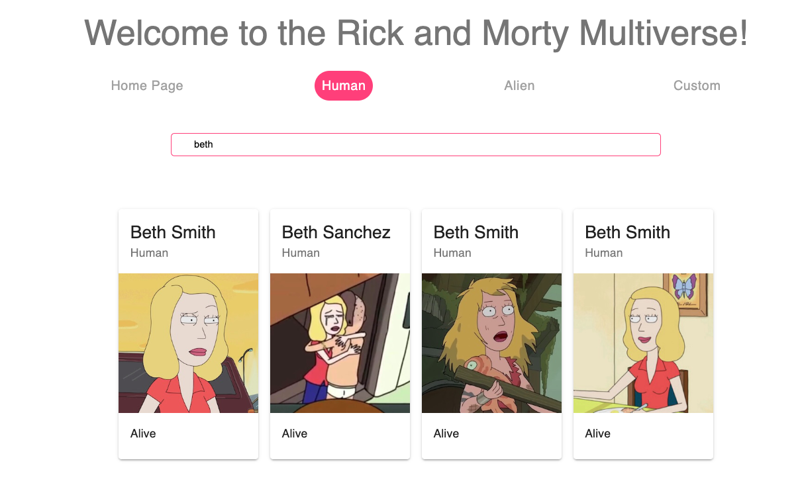
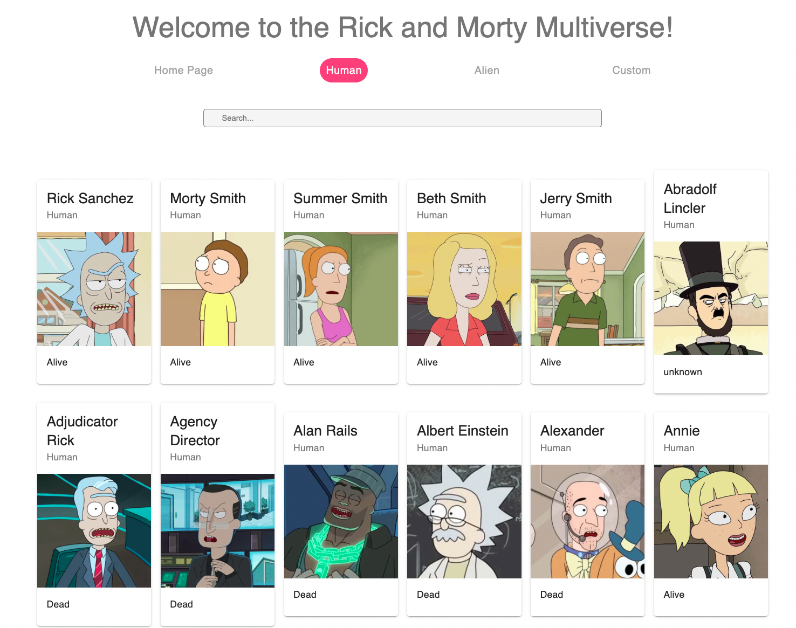
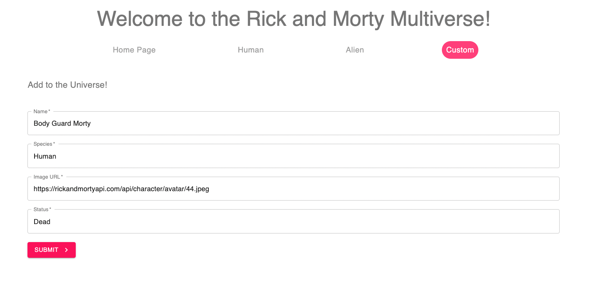
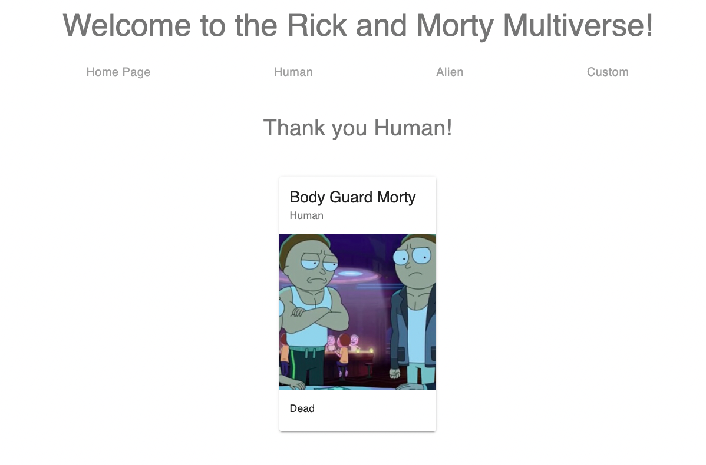

# Rick and Morty's Galactic Database

## Overview

With an infinite number of universes and an infinite amount of versions of characters, now they come together in one place! Rick and Morty's Database has all characters throughout all universes. Human or Alien, dead or alive, they are all here. Plus, now you can add your own character to the mix!

This database is filled with the most interesting characters the universe has to offer. 

## Features and How to Use

* # Search through the Rick and Morty DataBase using Rick and Morty API

* # Filter through Human charcaters and Alien characters

* # Add a character with their own custom attributes

* # Character Added!

### Requirements 
* Functional Web Browser

### Installation Instructions 
* Fork and clone
* Run 'npm run server'
* Run 'npm start' in preferred web browser 